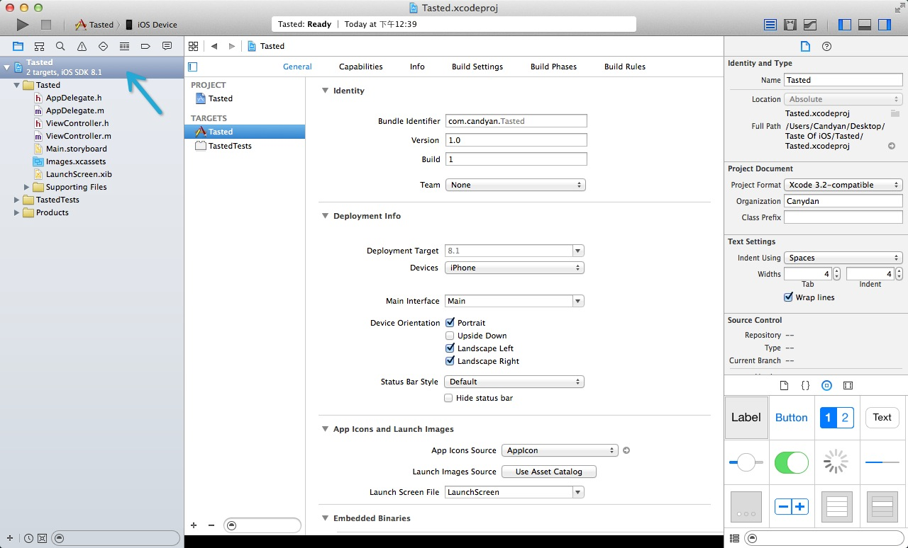
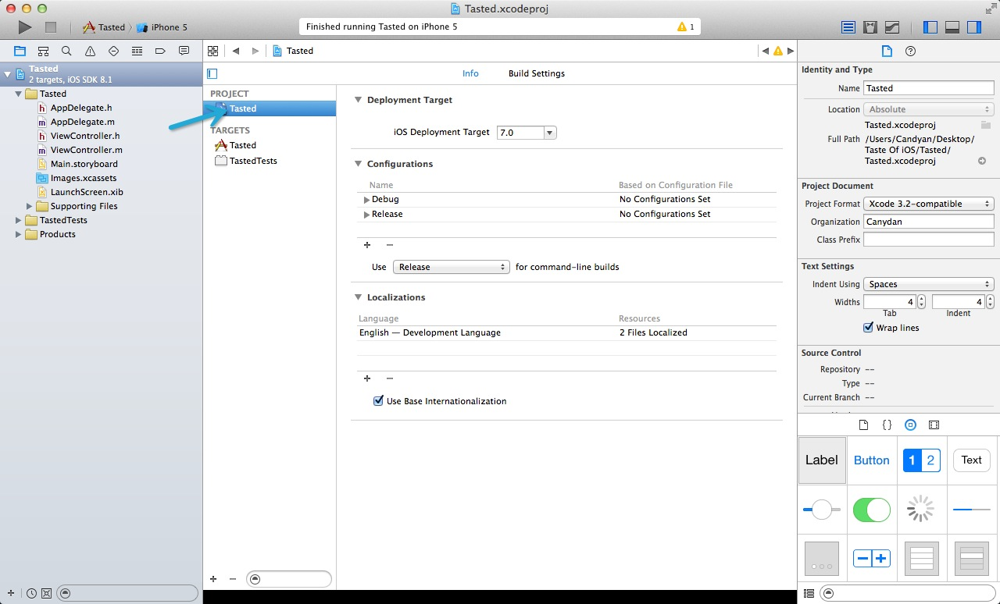
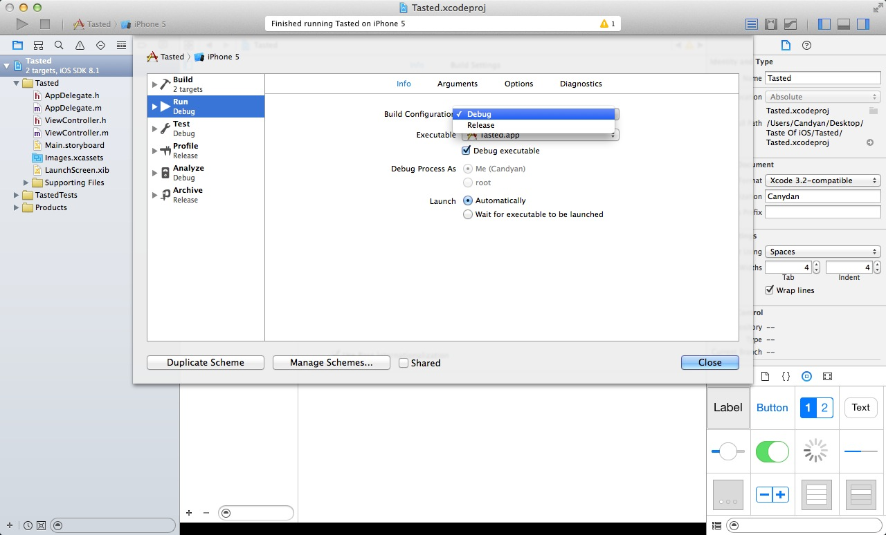
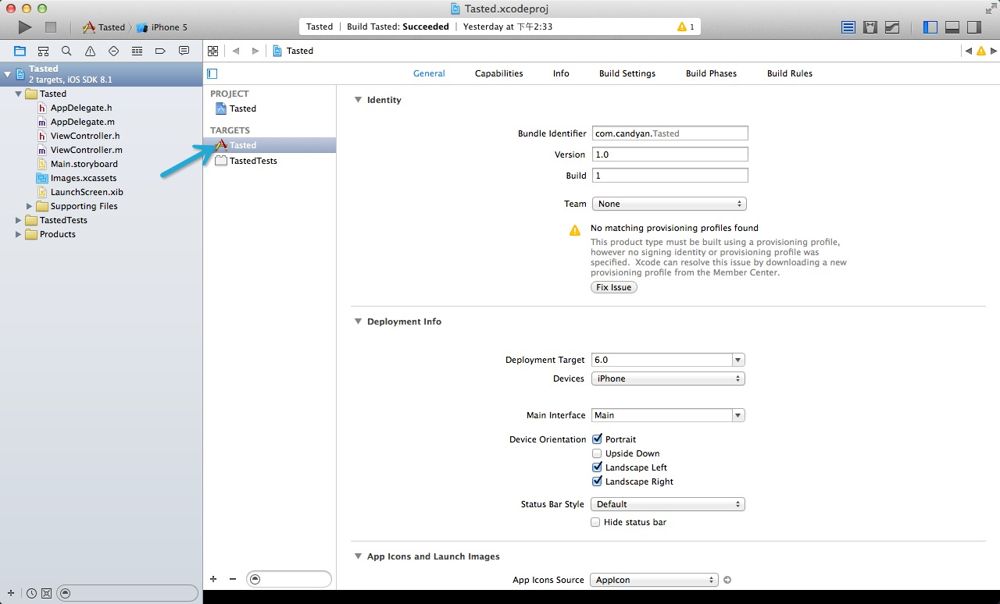
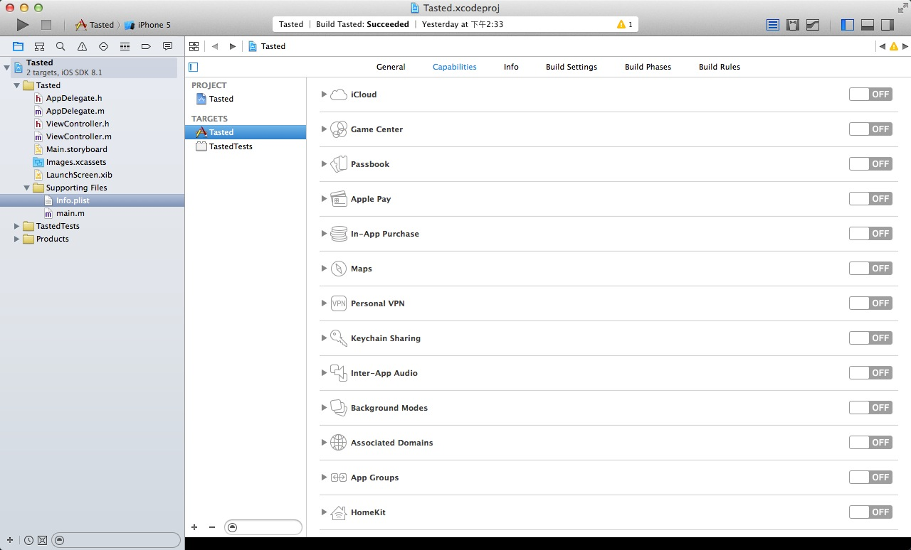
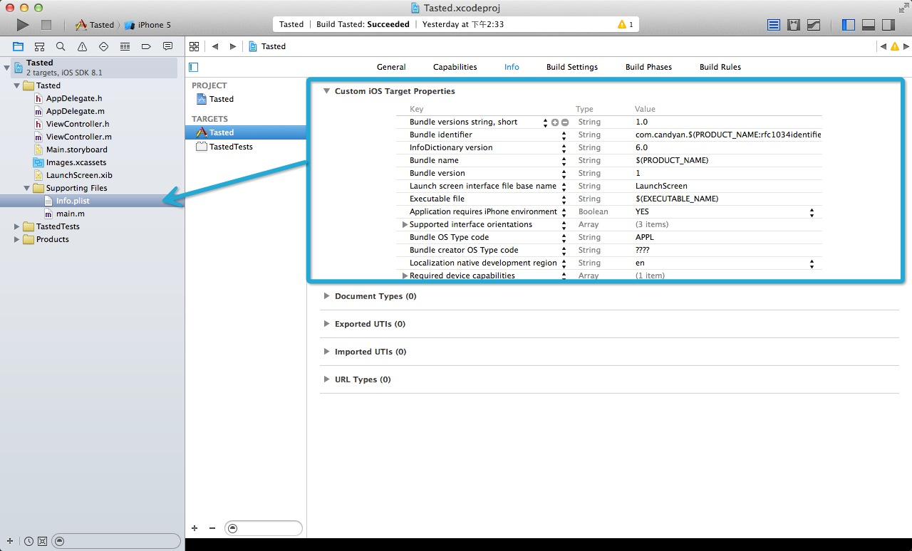
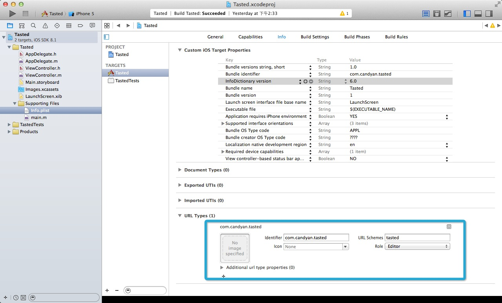

#2.2 应用配置和项目结构

上一节我们介绍了如果创建一个 Xcode 工程，那么在这节里面我们将介绍：

1. 如何配置我们的工程
2. 什么样子的项目结构有利于提高我们的开发效率，使代码管理起来更加的方便快捷。

## 应用配置

首先工程和应用配置的入口在下图箭头的位置，点击之后我们就可以进入工程的配置文件。

进入配置文件之后，我们会看到编辑区域的左侧有两个大的分类：`PROJECT` 和 `TARGETS`。`PROJECT` 里面是整个工程的配置文件；而 `TARGETS` 里面 包含了这个工程中不同的可执行程序的配置文件，每个target都代表了一个编译执行的程序，这个程序可以是一个可以运行的App，可以是一个测试，可以是一个应用扩展，也可以是一个静态库或或者Framework。

那么我们来分别看下 `PROJECT` 和 `TARGETS`的配置：

#### PROJECT 配置

我们先点击 `PROJECT` 下面的 `Tasted` 工程，就会出现下图：

`PROJECT` 配置主要分为两个部分 `info`  和 `Build Settings`。而 `Build Settings` 通常是在每个 target 里面单独配置的，我们很少去改动整个工程的编译设置。所以在这里我们来主要介绍一下 `info` 的配置。

`Deployment Target`：定义了我们这个工程在部署时使用的最低 `iOS SDK` 版本。

>
> TIPS： 这个配置是应用在工程上面的，对于每个 `Target` 也会有一个相应的配置的，所以关于这个配置的说明我们会放到后面 `target` 中再详细说明。
>

`Configurations`：定义了我们在编译的时候可以使用的配置。在创建工程的时候会有两个默认的配置：`Debug` 和 `Release`。在你运行你的应用时，Xcode会使用`Debug`配置来编译和签名你的应用，在你打包(Archive)你的应用时，Xcode 会使用 `Release` 配置来编译和签名你的应用。这个设置实在 Tool bar scheme-> Manager schemes -> edit 里面配置的，你可以对它进行修改。

当然了你也可以点击 `Configurations` 下面的 `+` 来创建其他的配置。比如可以建立一个在发布inhous版本的时候使用的配置等。

`Localizations`：定义了我们应用的本地化语言，默认是英语，你也可以添加简体中文，繁体中文，日语等语言。当在不同的地区时，系统会帮你使用用不用的语言文件。

`PROJECT` 配置大致需要我们关注的就是这些内容，下面我们来看下 `TARGETS` 配置。

====

#### TARGET 配置

`TARGET` 的配置配置，主要分为5大部分 `General` `Capabilities` `Info` `Build Settings` `Build Phases` 和 `Build Rules`。下面我们来介绍一些常用的配置：

`General`：通用配置里面包括了一些应用基本信息的配置。这个里面着重介绍一下下面的着几个配置。

- version & build：从名字上来看就可以很清楚的区分这两个字段的不同：一个是当前的版本号，对应 `Info.plist` 里面的 `CFBundleShortVersionString` 字段；另一个是你当前版本的编译次数，对应 `Info.plist` 里面的 `CFBundleVersion` 字段。

	当然了，如果你的编译管理没有这么严格，那么可以用下面的形式：version：1.0.0 build：10000。

	>
	> TIPS：最好不要把 `version` 和 `build` 都写成一样的，这样做在统计和版本判断上可能会出现不必要的麻烦。
	>

- `Deployment Target`：定义了我们这个应用允许在哪个 `iOS SDK` 版本以上才可以安装或升级。对于一个全新的应用，安装用户的 iOS 版本低于这个值，那么是不允许安装这个应用的；对于一个升级的应用，升级用户的 iOS 版本低于这个值，那么是不允许升级这个应用的，会提示需要升级你的 iOS 系统，但并不会影响到上个版本的使用。

	>
	> TIPS：建议全新应用和升级应用兼容最新和上一个版本的SDK（例如：现在Apple 发布了最新的iOS 8 版本，那么你可以把这个只调整为 7.0）；对体验要求比较高的应用可以只兼容最新版本的SDK；对于一个在做成熟产品移动化的新应用，可以再往下兼容一个版本，但总的兼容SDK的数量不要超过三个。因为每兼容一个版本的SDK，工作量会大大加大，而且收益会越来越低。
	>

`Capabilities`：这里面定义了很多应用附加功能的开关，如果你需要某些功能，那么就需要在这里把这些功能打开。具体这些功能都是什么，如何使用，我们会在之后单独开一个专题来说一说。

`Info`：这里面定义了我们应用里面用到的所有信息。

- Custom iOS Target Properties：从上图中我们可以看出，`Custom iOS Target Properties` 就是 `Info.plist` 里面的内容。在这个里面，我们可以更改：`Bundle name`(`iOS` 桌面上显示的名字)；`Bundle identifier` 等...

	>
	> TIPS：如果你需要动态改变 status bar的颜色和状态的话，就需要添加 `View controller-based status bar appearance`字段，并设置为 `NO`。
	>
	
- Document Types & Exported UTIs & Import UTIs: 这三个配置是：让其他app可以通过你的程序来打开某些类型的文件，或者你的app调用其他app来显示某些类型的文件用的。这个配置大部分的app都用不到。所以这里就不做详细的介绍了。

- URL Types：我们的程序可以向系统注册自己的 `URL Scheme`，来使得另外一个App可以通过这个 URL Scheme 来打开我们的应用。例如我们添加了一个 `URL Scheme`：

	
	
	这样，其他的程序就可以通过 `tasted://` 来打开我们的应用了。
	
	>
	> TIPS：如果你的 `URL Scheme` 跟其他的App重复了，那么会调用谁，就听天由命了。所以，最好不要使用一样的 `URL Scheme`，可以通过加前缀的方式来避免。
	>

